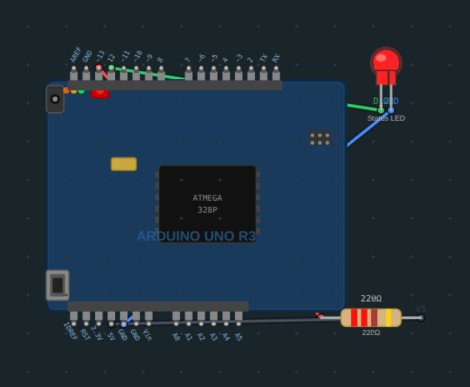
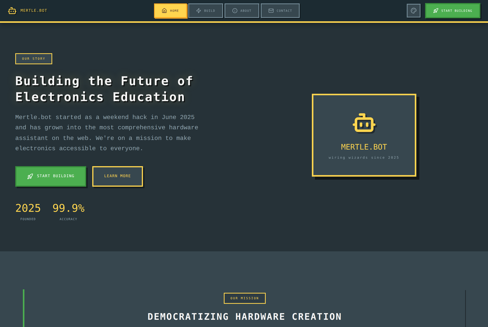

# Mertle Bot

[](https://github.com/josephg29/mertlebot/actions/workflows/ci.yml)
[](https://josephg29.github.io/mertlebot/)
[](#license)

**▶ Live showcase:** [josephg29.github.io/mertlebot](https://josephg29.github.io/mertlebot/) — the real wiring engine, running client-side (no API key needed).

**Mertle turns a plain-English electronics idea into a buildable project — parts list, Arduino code, a wiring diagram you can actually follow, and a one-click Wokwi simulation.**

The interesting part isn't that it calls an LLM. It's what happens *after* the model answers: every generated circuit is parsed, geometrically validated against real board pin positions, cross-checked against the generated code, and — when something is wrong — automatically repaired before you ever see it. LLMs hallucinate wiring constantly; Mertle is built around catching that.



> A real render from Mertle's SVG wiring engine — Arduino Uno + LED + current-limiting resistor, pins labeled, wires routed.

## How it works

```
Your prompt
   │
   ▼
Haiku draft (streamed)  ── fast first pass, intent classification
   │
   ▼
summarizeSupport()      ── parse the diagram, check every component pin
   │                       connects to a real board pin within tolerance,
   │                       cross-check CODE pins vs the diagram
   ├── valid ───────────► render the SVG diagram + guide
   │
   └── invalid
        │
        ▼
   repairGuide()         ── snap off-pin wires back onto their board pins
        │
        ▼
   Sonnet rewrite        ── escalate to the stronger model if still invalid
```

The validation and repair logic lives in [`src/lib/projectSupport.js`](src/lib/projectSupport.js) and is covered by [unit tests](src/tests/projectSupport.test.js) that exercise the real pin geometry. The diagram renderer is a custom SVG engine in [`src/lib/wiregen/`](src/lib/wiregen) — no Fritzing, no Wokwi embed, hand-drawn board and part geometry with an automatic wire de-overlap pass.

## Engineering highlights

- **Custom SVG wiring engine** ([`src/lib/wiregen/`](src/lib/wiregen)) — board and component geometry defined pin-by-pin in [`boardPins.js`](src/lib/wiregen/boardPins.js); [`WiringCanvas.svelte`](src/lib/wiregen/WiringCanvas.svelte) renders, pans, and zooms; [`wireDeOverlap.js`](src/lib/wiregen/wireDeOverlap.js) routes wires so they don't stack.
- **Deterministic validation + repair** ([`src/lib/projectSupport.js`](src/lib/projectSupport.js)) — connectivity checks within a 10px tolerance, I2C-pin enforcement per board, code-vs-diagram pin cross-checks, and a wire-snapping repair pass that fixes near-miss diagrams without another model call.
- **Two-tier model pipeline** — a fast Haiku draft is validated locally and only escalates to Sonnet for repair when needed, keeping latency and cost down.

## Features

- **Build guide generation** — describe a project, get parts, code, an SVG wiring diagram, and a step-by-step guide
- **5 skill levels** — Monkey, Novice, Builder, Hacker, Expert — adjust how much the guide explains
- **Wiring diagrams** for Arduino Uno / Nano / Mega and ESP32 with common parts (LEDs, resistors, buttons, servos, sensors, OLED/LCD, …)
- **Wokwi simulation** — a live circuit-sim link for supported builds
- **Clarification flow** — asks targeted questions before generating to improve accuracy
- **Built-in safety rails** — per-IP rate limiting, a global daily demo cap, same-origin enforcement, and CSP headers



## Tech stack

- **Frontend / backend** — SvelteKit 2 + Svelte 5 (runes), API routes on Node via `@sveltejs/adapter-node`
- **AI** — Anthropic Claude (`claude-sonnet-4-6` + `claude-haiku-4-5` via `@anthropic-ai/sdk`)
- **Testing** — Vitest
- **Deployment** — Docker / Fly.io

## Getting started

### Prerequisites

- Node.js 20+
- An Anthropic API key — [console.anthropic.com](https://console.anthropic.com/settings/keys)

### Installation

```bash
git clone https://github.com/josephg29/mertlebot.git
cd mertlebot
npm install
cp .env.example .env
# add ANTHROPIC_API_KEY to .env
npm run dev
```

Open [http://localhost:4444](http://localhost:4444).

### Environment variables

| Variable | Required | Default | Purpose |
|----------|----------|---------|---------|
| `ANTHROPIC_API_KEY` | yes | — | Powers the whole generation pipeline |
| `PORT` | no | `3000` | Production server port |
| `DEMO_DAILY_LIMIT` | no | `300` | Caps Anthropic-billed requests/day; `0` disables |

### Production

```bash
npm run build
npm start
```

### Docker

```bash
docker compose up --build
```

See [DEPLOYMENT.md](DEPLOYMENT.md) for Fly.io and container deployment.

## Project structure

```
src/
├── hooks.server.js           # Same-origin checks, rate limit, daily cap, CSP
├── routes/
│   ├── +page.svelte          # Landing
│   ├── build/                # Build UI (prompt, stream, wiring, guide)
│   ├── contact/
│   └── api/
│       ├── generate/         # Build guide generation (SSE stream + repair)
│       ├── clarify/          # Clarification questions
│       ├── simulate/         # Wokwi simulation generation
│       ├── key/              # API-key status (server-managed)
│       └── health/           # Health check
├── lib/
│   ├── server/
│   │   ├── config.js         # Reads ANTHROPIC_API_KEY from env
│   │   ├── llm-service.js    # Claude API wrapper + intent routing
│   │   ├── prompts.js        # System prompts per skill level
│   │   └── wokwi.js          # Wokwi diagram/sketch payloads
│   ├── projectSupport.js     # Diagram parsing, validation, and repair
│   └── wiregen/              # Custom SVG wiring engine
│       ├── WiringCanvas.svelte
│       ├── boardPins.js      # Pin geometry per board
│       ├── wireDeOverlap.js  # Wire routing
│       ├── boards/           # Uno, Nano, Mega, ESP32
│       └── parts/            # LED, resistor, servo, DHT22, OLED, …
└── tests/                    # Vitest suites (validation engine, wokwi)
```

## API reference

### `POST /api/generate`
Streams a build guide via Server-Sent Events.

```json
{ "prompt": "LED blinker", "skill": 2, "age": 25, "clarifications": "..." }
```

### `POST /api/clarify`
Returns clarification questions for a prompt.

```json
{ "prompt": "temperature sensor" }
```

### `POST /api/simulate`
Generates a Wokwi simulation URL from a completed guide.

### `GET /api/health`
Returns `{ status: "ok", apiConfigured, timestamp }`.

## Skill levels

| # | Name | Audience |
|---|------|----------|
| 1 | MONKEY | 6-year-old, maximum hand-holding |
| 2 | NOVICE | 1–2 prior projects, friendly explanations |
| 3 | BUILDER | Comfortable with electronics, technical but accessible |
| 4 | HACKER | Experienced maker, concise and direct |
| 5 | EXPERT | Professional engineer, peer-level |

## Testing

```bash
npm test          # single run
npm run test:watch
```

The suite focuses on the validation engine in `projectSupport.js` — happy-path circuits, missing/duplicate pins, label/endpoint mismatches, I2C-pin enforcement, and the repair pass — using fixtures built from the real `boardPins.js` geometry.

## Regenerating screenshots

```bash
node scripts/capture-diagram.mjs   # renders the wiring engine to docs/screenshots/
node scripts/capture-app.mjs       # screenshots a running server's landing page
```

## License

MIT
